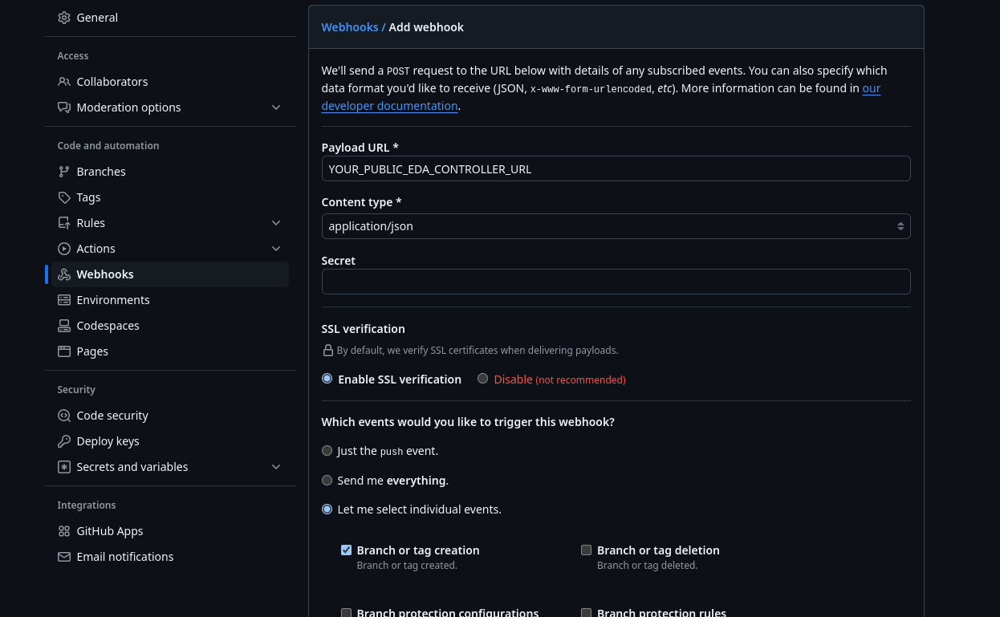

# Red Hat One - RHEL Image mode session repo

This repo is a working asset to deliver and replicate the RHEL Image mode Session running at Red Hat One 2025.

- [AAP Setup](#aap-setup)
   * [Prerequisites](#prerequisites)
   * [Configuring webhooks for GitHub](#configuring-webhooks-for-github)
   * [Lab deployment](#lab-deployment)
   * [demo-setup-vars.yml](#demo-setup-varsyml)
- [Inventory](#inventory)
   * [Demo use cases](#demo-use-cases)
   * [Creating a SOE image](#creating-a-soe-image)
   * [Creating the application ISO image](#creating-the-application-iso-image)
   * [Deploy our ISO on our device](#deploy-our-iso-on-our-device)
   * [Update the image with a new version of the Java Runtime](#update-the-image-with-a-new-version-of-the-java-runtime)

## AAP Setup

The folder [aap-setup](./aap-setup/) contains all required bits to configure all templates, credentials and inventories as well as rulebook activations on EDA that are needed for the demo.

### Prerequisites
- AAP 2.4+ installed and exposing EDA and Controller APIs
- A container registry available (in this example we are using [Gitea](https://docs.gitea.com/usage/packages/container) but you can use also local Quay or simple [docker registry](https://www.redhat.com/en/blog/simple-container-registry))
- [GitHub](https://github.com) Account to fork repositories and make changes

> [!NOTE]
> Your EDA Controller must be reachable from the internet, as we will configure GitHub webooks to trigger the image building process. If you don't have a public IP/domain, you can use [ngrok](https://ngrok.com) to have a free way to publish the URL to the web.

### Configuring webhooks for GitHub

Go to the [SOE repository](https://github.com/kubealex/rh1-image-mode-soe) and fork it, it will be available in your GitHub account (https://github.com/YOURGITHUBUSERNAME/rh1-image-mode-soe.git).

Go to the [SOE repository](https://github.com/kubealex/rh1-image-mode-container-app) and fork it, it will be available in your GitHub account (https://github.com/YOURGITHUBUSERNAME/rh1-image-mode-container-app).

In both repositories, go in the **Settings -> Webhooks** section and click on *Add webhook".

Configure the settings like the image below, adding:

- Your EDA Controller public URL
- Select *application/json* as Content type
- Select *Branch or tag creation* as the triggering event

We will need this to automatically trigger builds grabbing information about the tag names, revision, etc.




### Lab deployment

Install the required ansible collections by running:

```
$ ansible-galaxy install -r aap-setup/requirements.yml --force
```

Retrieve the Red Hat Automation Hub URLs and token from [console.redhat.com](https://console.redhat.com/ansible/automation-hub/token), as you will need them to fill the **automation_hub_** variables below.

Add Red Hat Automation Hub as primary content resource as shown [here](https://docs.redhat.com/en/documentation/red_hat_ansible_automation_platform/1.2/html/getting_started_with_red_hat_ansible_automation_hub/proc-configure-automation-hub-server#proc-configure-automation-hub-server)
and then install the other required collections:

### demo-setup-vars.yml

This file contains all required variables to populate projects, credentials and templates, edit the values according to your environment:

``` yaml
### Main repository URL pointing to this repo
main_repo_url: https://github.com/kubealex/rh1-image-mode.git

### Additional repos that need to be forked
image_mode_application_repo: https://github.com/YOURGITHUBUSERNAME/rh1-image-mode-container-app.git
image_mode_soe_repo: https://github.com/YOURGITHUBUSERNAME/rh1-image-mode-soe

### Container registry credentials where you will push images
rhel_image_mode_registry_url:
rhel_image_mode_registry_username:
rhel_image_mode_registry_password:

### Red Hat Container Registry authentication (use Red Hat ID Username/Password or service account)
redhat_registry_url:
redhat_registry_username:
redhat_registry_password:

### URL and creds for AAP2 Controller
aap2_controller_url: https://aap.rh-lab.labs:8443
aap2_controller_username: admin
aap2_controller_password: redhat

### URL and creds for AAP2 EDA Controller
eda_controller_url: https://aap.rh-lab.labs:8445
eda_controller_username: admin
eda_controller_password: redhat

### URL for Red Hat Automation Hub
automation_hub_url: https://console.redhat.com/api/automation-hub/content/published/
automation_hub_auth_url: https://sso.redhat.com/auth/realms/redhat-external/protocol/openid-connect/token
authomation_hub_token:

### Credentials for hosts
inventory_servers_username:
inventory_servers_password:
```

It is pre-filled with the demo setup fields, it MUST be changed according to your own environment.

Running the following command will end up creating all required resources:

Then run the lab deployment playbook like:

```
$ ansible-playbook aap-setup/configure-aap.yml -i inventory
```

### Inventory

The inventory file contains two groups, *webserver* and *build_host* that are respectively the server providing access to the ISO and the host that is needed to build the images. Adapt it to match your environment.

**The hosts will use the credentials defined in the demo-setup-vars.yml file (inventory_servers_)**

    [build_host]
    rhel-bootc.rh-lab.labs

    [webserver]
    rhel-bootc.rh-lab.labs

## Demo use cases

Our organization is willing to standardize the way developers build and ship their applications.
We decided to use RHEL Image mode to streamline the OS configuration and build/setup and our infrastructure team created a base image (we will refer to it as the Standard Operating Environment - SOE - Image) that developers will use to embed their application, Petclinic.

### Creating a SOE image

In the first use case we will create a base image that we will use for the application image build.
Go to the SOE repository you forked before (https://github.com/YOURGITHUBUSERNAME/rh1-image-mode-soe) and review the Containerfile.

As you can see it has a limited set of informations, that are considered enough from our infrastructure team to provide a base image for developers.

In GitHub or with your CLI, create a tag (i.e. v1.0-soe) and this will trigger an EDA action that runs the **[RH1][Image Mode Demo] Build Image Mode SOE Image** workflow that will:

- Clone the repo
- Build the image
- Run a container image scan
- Ask for approval to review the outcome of the scan
- If approved, it will push the image (by default it will be called *rhel-image-mode-demo* and it will have a *soe* image tag and another tag based on the GH commit) to the registry you defined in the variables

### Creating the application ISO image

Now that we built the SOE image, we want to provide our developers with the latest version of it to embed their application.

Go to the *container-app* repository you forked before (https://github.com/YOURGITHUBUSERNAME/rh1-image-mode-container-app.git) and review the Containerfile.

As you can see, it installs Java 11, the application bits, a DB and populates the DB with some initial data that is needed by the application.

We are now ready to generate the ISO image that we need to deploy.

> [!WARNING]
> It is important that the tag name contains the word *iso* as the Rulebook Activation in EDA performs a check on the tag name to distinguish between the diffrent kind of workflows o run.

> [!CAUTION]
> Replace **YOUR_REPOSITORY_URL** with the value of *rhel_image_mode_registry_url* variable.

In GitHub or with your CLI, create a tag (i.e. v1.0-iso) and this will trigger an EDA action that runs the **[RH1][Image Mode Demo] Build Image Mode application ISO** workflow that will:

- Clone the repo
- Build the image
- Run a container image scan
- Ask for approval to review the outcome of the scan
- If approved, it will push the image (by default it will be called *rhel-image-mode-demo* and it will have a *app* image tag and another tag based on the GH commit) to the registry you defined in the variables
- Start the conversion from container image to ISO image
- Upload the ISO image to our *webserver*

### Deploy our ISO on our device

Now that we have our ISO image in place, we can use it to install RHEL on our device.
To do so, we can create a bootable device (USB stick) with the ISO with a tool like [Fedora Media Writer](https://fedoraproject.org/de/workstation/download/).

If you don't have a device and you want to use a virtualized version, use your favourite Hypervisor to spin up the Virtual Machine using the ISO image you've just created

Once the deploy is completed, you can access your brand new VM with the application on top of it using the following credentials:

```bash
    username: bootc-user
    password: redhat
```

To verify that the application and the DB is running you can run:

```bash
sudo systemctl status mysqld petclinic
```

Verify that the installed Java version is 11:

```bash
java -version
```

In the installed system you will also find the utility called [bootc](https://github.com/containers/bootc) that will be responsible for managing ugprades/rollbacks and status checks for your RHEL Image mode system.

You can verify that you are using the correct image you created by issuing the following command:

```bash
sudo bootc status
```

### Update the image with a new version of the Java Runtime

Our developers updated the application to work with Java 17, so they are planning to release an update to the image to match the new version.

Go to the *container-app* repository you forked before (https://github.com/YOURGITHUBUSERNAME/rh1-image-mode-container-app.git) and review the *Containerfile-app17* file that contains the modifications.

As you can see, our developers bumped the installed JDK to version 17 and we want to propagate the change to the installed systems.

> [!CAUTION]
> Replace **YOUR_REPOSITORY_URL** with the value of *rhel_image_mode_registry_url* variable
> Copy the content of the *Containerfile-app17* into the *Containerfile* and push the changes

In GitHub or with your CLI, create a tag (i.e. v1.1-j17) and this will trigger an EDA action that runs the **[RH1][Image Mode Demo] Build Image Mode application image** workflow that will:

- Clone the repo
- Build the image
- Run a container image scan
- Ask for approval to review the outcome of the scan
- If approved, it will push the image (by default it will be called *rhel-image-mode-demo* and it will have a *app* image tag and another tag based on the GH commit) to the registry you defined in the variables

Once pushed, we can initiate the update on the system:

```bash
sudo bootc upgrade
```

Bootc will fetch the new image and upon next reboot the new version will be applied.

After logging back, you can verify that the Java version is 17:

```bash
java -version
```

And that the application is running:

```bash
sudo systemctl status mysqld petclinic
```
